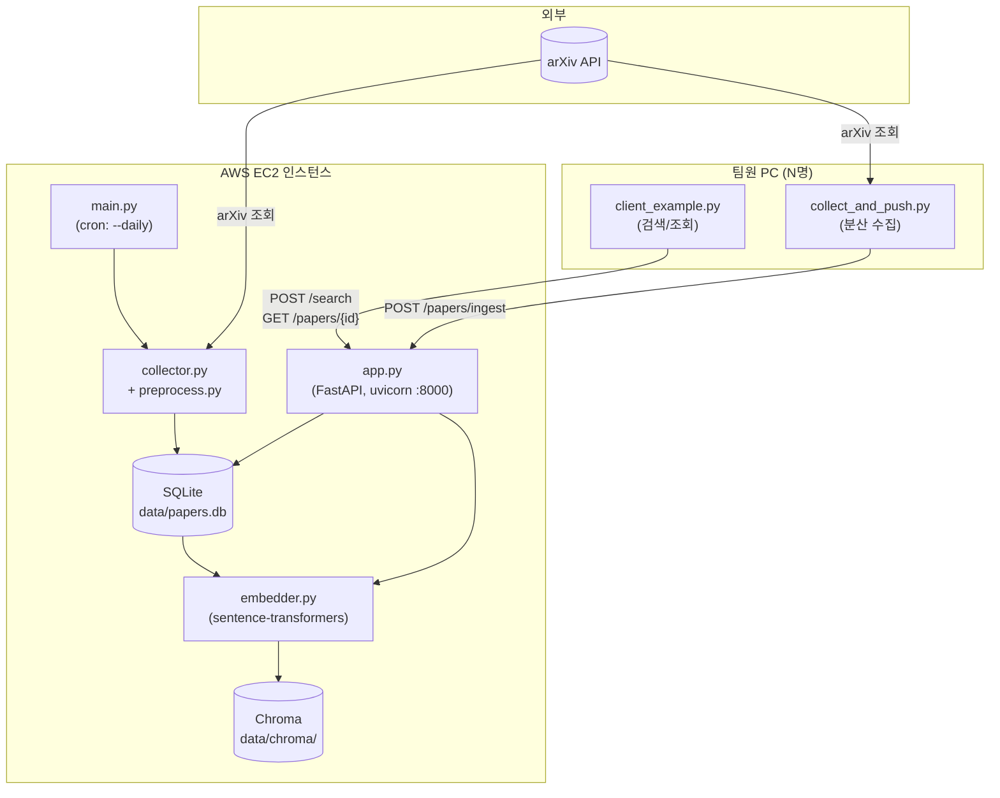
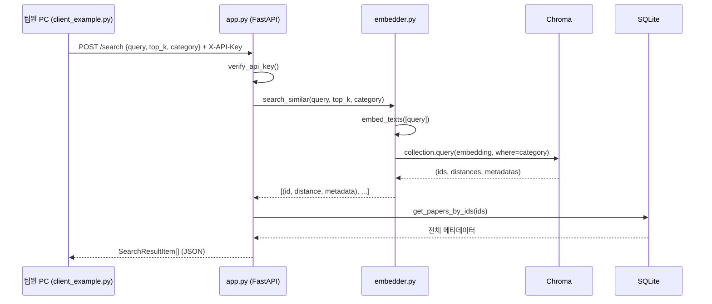
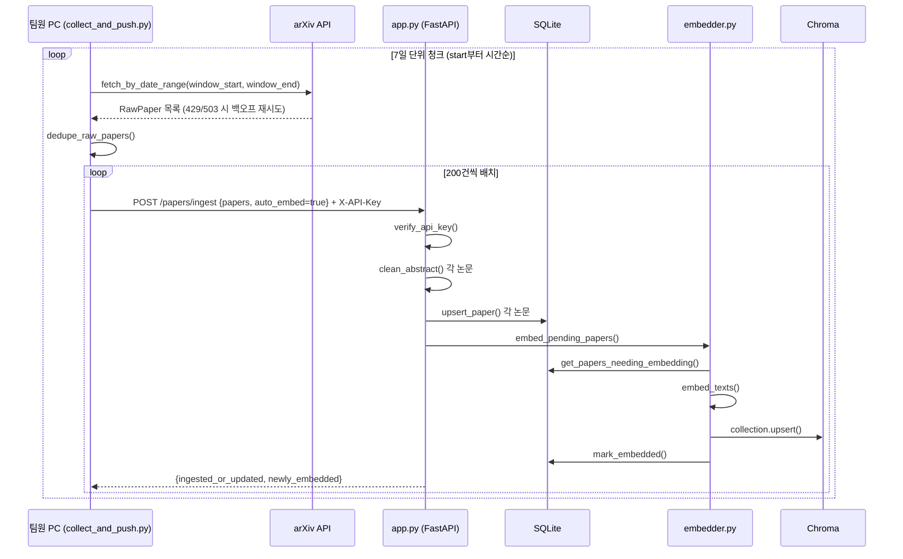

# arxiv 논문 개인 관심사 기반 추천 시스템 — 데이터 구축 정리 ( `arxiv_pipeline` )

---

## 1. 프로젝트 개요

| 항목 | 내용 |
|---|---|
| 프로젝트명 | arXiv 논문 추천 시스템 — 데이터 파이프라인 & 벤치마크 |
| 목적 | 팀원 개인 관심사(연구 주제)에 맞는 arXiv 논문을 자동으로 찾아주는 추천 시스템의 기반 데이터/평가 체계 구축 |
| 프로젝트 성격 | 여름 스프린트(단기 팀 프로젝트), 3인 팀 |
| 이 저장소가 다루는 범위 | 기획서상 **A. 논문 데이터베이스 구축** 전체 + **B. 평가 벤치마크 구축**의 데이터 인프라 부분. LLM 재랭킹/추천 로직 자체는 이 저장소 범위 밖(추후 단계) |
| 핵심 가치 | 무료 스택만 사용(arXiv API, SQLite, Chroma, sentence-transformers 전부 무료/로컬), 팀 전체가 하나의 공유 DB를 실시간으로 보는 구조 |
| 기술 스택 | Python 3, `arxiv` 라이브러리, SQLite, Chroma(벡터DB), sentence-transformers(BAAI/bge-small-en-v1.5), FastAPI, AWS EC2 |
| 배포 형태 | AWS EC2 인스턴스 1대에 API 서버 + DB가 모두 상주. 팀원은 REST API로만 접근 |

---

## 2. 전체 시스템 구조

```
                         ┌─────────────────────────────────────────┐
                         │              AWS EC2 인스턴스              │
                         │                                           │
   arXiv API  ◄──────────┤  main.py (cron, --daily)                 │
   (외부)                │  collector.py / preprocess.py            │
                         │        │                                  │
                         │        ▼                                  │
                         │  db.py (SQLite: data/papers.db)          │
                         │        │                                  │
                         │        ▼                                  │
                         │  embedder.py (sentence-transformers)     │
                         │        │                                  │
                         │        ▼                                  │
                         │  Chroma (data/chroma/, PersistentClient) │
                         │        ▲                                  │
                         │        │                                  │
                         │  app.py (FastAPI, uvicorn :8000)         │
                         └────────────────┬──────────────────────────┘
                                           │ HTTP + X-API-Key
                     ┌─────────────────────┼─────────────────────┐
                     ▼                     ▼                     ▼
            팀원 PC #1              팀원 PC #2              팀원 PC #3
       client_example.py       client_example.py       client_example.py
       collect_and_push.py     collect_and_push.py      (조회만 해도 됨)
```

| 구성 요소 | 위치 | 역할 |
|---|---|---|
| arXiv API | 외부(export.arxiv.org) | 논문 메타데이터 원본 소스. 무료지만 rate limit/페이지네이션 제약 있음 |
| 수집 파이프라인 (`collector.py`, `preprocess.py`, `main.py`) | EC2 | arXiv 조회 → 정제 → DB 저장을 자동화 |
| SQLite (`data/papers.db`) | EC2 로컬 파일 | 논문의 정형 메타데이터(제목/저자/초록/카테고리 등) 저장 |
| Chroma (`data/chroma/`) | EC2 로컬 파일 | 초록 임베딩 벡터 저장, 유사도 검색 인덱스 |
| 임베딩 엔진 (`embedder.py`) | EC2 (FastAPI 프로세스 내) | 초록 → 벡터 변환(sentence-transformers), Chroma 적재/검색 |
| FastAPI 서버 (`app.py`) | EC2, `uvicorn` 프로세스 | 팀 전체가 공유 DB에 접근하는 유일한 창구. 인증(API Key) 담당 |
| 팀원 클라이언트 (`client_example.py`, `collect_and_push.py`) | 각자 PC | 조회(검색) 및 분산 수집. 무거운 ML 라이브러리 불필요 |

**설계 원칙**: Chroma/SQLite는 절대 팀원 PC에 직접 노출하지 않는다. 모든 접근은 FastAPI를 통해서만 이루어진다 (인증 계층을 한 곳에 집중시키고, 팀원 PC에는 무거운 의존성을 안 깔아도 되게 하기 위함).

---

## 3. 디렉토리 구조

```
summer_sprint/                      # 저장소 루트 (GitHub 공유 대상)
├── .gitignore                      # 비밀값/생성데이터 커밋 방지
├── README.md                       # 실행 가이드 (실무자용, 자주 참고)
├── HANDOVER.md                     # 이 문서 (신규 개발자 온보딩/아키텍처 문서)
└── arxiv_pipeline/
    ├── config.py                   # 전역 설정 (카테고리, 경로, API 키, 모델명)
    ├── db.py                       # SQLite 스키마 + CRUD 함수
    ├── collector.py                # arXiv API 수집 로직
    ├── preprocess.py               # 중복 제거 + 텍스트 클린업
    ├── embedder.py                 # 임베딩 계산 + Chroma 연동
    ├── main.py                     # 서버 전용 CLI (backfill/daily)
    ├── app.py                      # FastAPI 서버 (팀 공유 API)
    ├── client_example.py           # 팀원용 조회 클라이언트
    ├── collect_and_push.py         # 팀원용 분산 수집 스크립트
    ├── local_config.example.py     # 개인 설정 템플릿 (커밋됨)
    ├── local_config.py             # 개인 실제 설정 (❌ 커밋 안 됨)
    ├── requirements.txt            # 서버(EC2)용 전체 의존성
    ├── requirements-client.txt     # 팀원용 최소 의존성
    └── data/                       # 실행 시 자동 생성, ❌ 커밋 안 됨
        ├── papers.db                # SQLite 파일
        ├── chroma/                  # Chroma 벡터 인덱스
        └── last_run.json            # 마지막 daily 실행 시각
```

---

## 4. 각 파일의 역할

| 파일 | 계층 | 의존성(무거움) | 한 줄 역할 |
|---|---|---|---|
| `config.py` | 공통 | 없음(가벼움) | 전역 상수/설정. 다른 모든 모듈이 참조하는 단일 진실 공급원(SSOT) |
| `db.py` | 데이터 계층 | 없음(가벼움, sqlite3는 표준 라이브러리) | SQLite 스키마 정의 및 모든 DB 접근 함수 |
| `collector.py` | 수집 계층 | `arxiv` (가벼움) | arXiv API 호출, 원본 데이터를 `RawPaper`로 변환 |
| `preprocess.py` | 전처리 계층 | 없음(가벼움) | 중복 제거, 초록 텍스트 클린업 |
| `embedder.py` | ML 계층 | `sentence-transformers`, `chromadb`, `torch` (무거움) | 임베딩 계산 + 벡터 저장/검색. **서버에만 설치** |
| `main.py` | 실행 계층(서버 전용) | 위 전부 | 수집 파이프라인 전체를 묶어 실행하는 CLI |
| `app.py` | API 계층(서버 전용) | 위 전부 + `fastapi`, `uvicorn` | 팀 공유 REST API 서버 |
| `client_example.py` | 클라이언트 계층 | `requests` (가벼움) | 팀원이 검색/조회할 때 쓰는 함수 모음 |
| `collect_and_push.py` | 클라이언트 계층 | `requests`, `arxiv` (가벼움) | 팀원이 본인 PC에서 수집→서버 반영 |
| `local_config.example.py` / `local_config.py` | 설정 | 없음 | 클라이언트가 접속할 서버 주소/키 |

---

## 5. 클래스별 역할

이 프로젝트는 함수형 스타일 위주라 클래스 수가 적습니다. `dataclass`와 FastAPI의 `pydantic.BaseModel`이 대부분입니다.

| 클래스 | 파일 | 종류 | 역할 |
|---|---|---|---|
| `RawPaper` | `collector.py` | `@dataclass` | arXiv에서 막 조회한 원본 논문 1건. 아직 DB 스키마 형태로 정제되기 전 |
| `PaperRecord` | `db.py` | `@dataclass` | DB에 저장할 논문 1건의 형태 (전처리 완료 후). `upsert_paper()`의 입력 타입 |
| `SearchRequest` | `app.py` | Pydantic `BaseModel` | `POST /search` 요청 바디: `query`, `top_k`, `category` |
| `SearchResultItem` | `app.py` | Pydantic `BaseModel` | `POST /search` 응답의 논문 1건 (Chroma 검색 결과 + SQLite 메타데이터 join) |
| `RawPaperIn` | `app.py` | Pydantic `BaseModel` | `POST /papers/ingest` 요청의 논문 1건 (팀원이 보내는 원본, abstract_clean은 미포함) |
| `IngestRequest` | `app.py` | Pydantic `BaseModel` | `POST /papers/ingest` 요청 바디: `papers` 리스트 + `auto_embed` 플래그 |
| `IngestResponse` | `app.py` | Pydantic `BaseModel` | ingest 처리 결과: 신규/갱신 건수, 임베딩 건수 |
| `PaperDetail` | `app.py` | Pydantic `BaseModel` | `GET /papers/{id}` 응답. `papers` 테이블 전체 컬럼 매핑 |

---

## 6. 함수별 역할

### `config.py`
값만 있고 함수 없음 (의도적 — 설정은 순수 데이터여야 부작용이 없음).

### `db.py`

| 함수 | 시그니처 | 역할 |
|---|---|---|
| `get_conn()` | `() -> ContextManager[Connection]` | SQLite 커넥션 context manager. `timeout=30`으로 동시쓰기 대기 허용 |
| `init_db()` | `() -> None` | 스키마(`SCHEMA`) 실행, 테이블/인덱스 생성 |
| `upsert_paper(conn, rec)` | `(Connection, PaperRecord) -> bool` | 신규면 INSERT, 기존 버전보다 높으면 UPDATE(+임베딩 플래그 리셋), 아니면 무시. 반환값은 "변경됨" 여부 |
| `get_papers_needing_embedding(conn)` | `(Connection) -> list[tuple]` | `embedded=0`인 논문만 조회 (임베딩 대상 큐 역할) |
| `mark_embedded(conn, ids)` | `(Connection, Iterable[str]) -> None` | 임베딩 완료 플래그 일괄 업데이트 |
| `count_papers(conn)` | `(Connection) -> int` | 전체 논문 수 |
| `get_paper_by_id(conn, id)` | `(Connection, str) -> Optional[dict]` | 논문 1건 전체 메타데이터 |
| `get_papers_by_ids(conn, ids)` | `(Connection, Iterable[str]) -> dict` | 여러 건 한 번에 조회 (검색 결과 join용) |

### `collector.py`

| 함수 | 시그니창 | 역할 |
|---|---|---|
| `_split_id_version(short_id)` | `(str) -> (str, int)` | `"2401.12345v2"` → `("2401.12345", 2)` |
| `_result_to_raw(result)` | `(arxiv.Result) -> RawPaper` | arxiv 라이브러리 결과 객체를 내부 형식으로 변환 |
| `_make_client()` | `() -> arxiv.Client` | 페이지 크기/딜레이/재시도 설정된 클라이언트 생성 |
| `fetch_by_date_range(start, end, categories)` | `(datetime, datetime, list) -> Iterator[RawPaper]` | **가장 기본이 되는 단일 쿼리 함수**. 결과가 너무 많으면(약 10,000건↑) arXiv가 HTTP 500을 낸다는 제약이 있음 |
| `fetch_since(last_run, categories)` | `(datetime, list) -> Iterator[RawPaper]` | 마지막 실행 이후 ~ 지금까지 (daily용, 결과가 적어 청크 불필요) |
| `fetch_recent_months(months, categories)` | `(int, list) -> Iterator[RawPaper]` | 레거시 편의 함수. **현재는 `main.py`가 직접 안 씀** (청크 미적용이라 큰 범위엔 부적합) |
| `fetch_by_date_range_chunked(start, end, categories, chunk_days, max_retries, retry_base_seconds)` | `(...) -> Generator[(datetime, datetime, list[RawPaper])]` | **실무에서 실제로 쓰이는 핵심 함수.** 긴 기간을 `chunk_days` 단위로 쪼개 시간순으로 조회 + 429/503 발생 시 백오프 재시도까지 담당 |

### `preprocess.py`

| 함수 | 시그니처 | 역할 |
|---|---|---|
| `clean_abstract(text)` | `(str) -> str` | LaTeX 수식/명령어, 줄바꿈, 중복 공백 제거 |
| `dedupe_raw_papers(papers)` | `(Iterable[RawPaper]) -> list[RawPaper]` | arxiv_id 기준 중복 제거, 최고 버전 유지, 카테고리 합집합 병합 |

### `embedder.py`

| 함수 | 시그니처 | 역할 |
|---|---|---|
| `get_model()` | `() -> SentenceTransformer` | 임베딩 모델 lazy load (싱글턴 캐싱) |
| `get_collection()` | `() -> chromadb.Collection` | Chroma PersistentClient + 컬렉션 lazy load |
| `embed_texts(texts)` | `(list[str]) -> list[list[float]]` | 텍스트 배치를 정규화된 임베딩 벡터로 변환 |
| `embed_pending_papers(batch_size)` | `(int) -> int` | `embedded=0`인 논문을 배치로 임베딩 계산 → Chroma upsert → DB 플래그 갱신. 반환값은 새로 임베딩된 건수 |
| `search_similar(query_text, top_k, category)` | `(str, int, Optional[str]) -> list[(id, distance, metadata)]` | 쿼리 텍스트 임베딩 후 Chroma 유사도 검색 (카테고리 필터 지원) |

### `main.py` (서버 전용 CLI)

| 함수 | 시그니처 | 역할 |
|---|---|---|
| `_load_last_run()` | `() -> datetime` | `data/last_run.json`에서 마지막 실행 시각 로드 (없으면 1일 전) |
| `_save_last_run(ts)` | `(datetime) -> None` | 실행 시각 저장 |
| `_ingest(raw_papers)` | `(list[RawPaper]) -> int` | dedupe → clean → `PaperRecord` 변환 → DB upsert. 반환값은 변경 건수 |
| `run_backfill(months, skip_embedding)` | `(int, bool) -> None` | 최근 N개월을 `fetch_by_date_range_chunked`로 청크 처리하며 순차 ingest, 끝나면 일괄 임베딩 |
| `run_daily(skip_embedding)` | `(bool) -> None` | 마지막 실행 이후 신규분만 수집 + ingest + 임베딩 |
| `main()` | `() -> None` | argparse 진입점. `--backfill N` / `--daily` / `--skip-embedding` |

### `app.py` (FastAPI 엔드포인트)

| 함수(엔드포인트) | 메서드/경로 | 역할 |
|---|---|---|
| `verify_api_key(x_api_key)` | (의존성) | 모든 인증 필요 엔드포인트에서 `Depends()`로 사용. 키 불일치 시 401 |
| `health()` | `GET /health` | 서버/DB 생존 확인, 논문 수 반환. 인증 불필요 |
| `search(req)` | `POST /search` | 임베딩 검색 실행 + SQLite 메타데이터 join 후 반환 |
| `ingest_papers(req)` | `POST /papers/ingest` | 팀원이 보낸 논문 배치를 정제·저장·임베딩까지 서버가 처리 |
| `get_paper(arxiv_id)` | `GET /papers/{arxiv_id}` | 단건 상세 조회, 없으면 404 |
| `list_papers_by_ids(ids)` | `GET /papers?ids=` | 다건 조회 |

### `client_example.py`

| 함수 | 역할 |
|---|---|
| `search(query, top_k, category)` | `/search` 호출 래퍼 |
| `get_paper(arxiv_id)` | `/papers/{id}` 호출 래퍼 |
| `get_papers(arxiv_ids)` | `/papers?ids=` 호출 래퍼 |

### `collect_and_push.py`

| 함수 | 역할 |
|---|---|
| `_to_payload(p)` | `RawPaper` → API 전송용 dict 변환 |
| `_push_batch(papers, ...)` | 논문 리스트를 `BATCH_SIZE`(200)씩 나눠 `/papers/ingest` 호출 |
| `collect_and_push_range(start, end, categories, chunk_days)` | 지정 구간을 청크 단위로 수집하며 배치 전송 (핵심 로직) |
| `collect_and_push(days, categories, chunk_days)` | "최근 N일" 편의 래퍼 (`collect_and_push_range` 호출) |
| `_parse_date(s)` | `"YYYY-MM-DD"` 문자열 파싱 |

---

## 7. 데이터 흐름

### 7-1. 서버 자동 수집 (`main.py`)

```
arXiv API
   │  fetch_by_date_range_chunked (7일 단위, 429/503 자동 재시도)
   ▼
RawPaper 리스트
   │  dedupe_raw_papers (preprocess.py)
   ▼
중복 제거된 RawPaper
   │  clean_abstract + PaperRecord 변환 (main.py._ingest)
   ▼
SQLite upsert (db.py)
   │  embed_pending_papers (embedder.py, 전체 수집 끝난 뒤 1회)
   ▼
Chroma에 벡터 저장
```

### 7-2. 팀원 분산 수집 (`collect_and_push.py`)

```
팀원 PC                                    EC2 서버
────────                                   ────────
arXiv API 조회 (collector.py)
   │
dedupe (preprocess.py)
   │
POST /papers/ingest ──────────────────►  clean_abstract (서버가 수행)
                                             │
                                          upsert_paper (SQLite)
                                             │
                                          embed_pending_papers (배치당 즉시)
                                             │
                                          Chroma 갱신
              ◄────────────────────────  {ingested_or_updated, newly_embedded}
```

**핵심 설계 포인트**: 초록 클린업 규칙과 버전 비교 로직은 서버에 단 하나만 존재한다 (`app.py`가 `preprocess.clean_abstract`와 `db.upsert_paper`를 호출). 클라이언트가 규칙을 중복 구현하면 서버/클라이언트 로직이 어긋날 위험이 있어 의도적으로 서버 쪽에 집중시켰다.

### 7-3. 검색 (팀원 → 서버)

```
팀원: client_example.search("VLM 로봇 매니퓰레이션...", top_k=20, category="cs.RO")
   │
POST /search (X-API-Key 헤더)
   │
app.py: search_similar() 호출 (embedder.py)
   │  쿼리 텍스트 임베딩 → Chroma 유사도 검색 → (id, distance, chroma_metadata) 리스트
   │
app.py: get_papers_by_ids()로 SQLite에서 전체 메타데이터 join
   │
SearchResultItem 리스트로 응답
```

---

## 8. API 호출 흐름

| # | 메서드 | 경로 | 인증 | 요청 바디/파라미터 | 응답 |
|---|---|---|---|---|---|
| 1 | GET | `/health` | 불필요 | 없음 | `{status, paper_count}` |
| 2 | POST | `/search` | `X-API-Key` | `{query, top_k, category?}` | `SearchResultItem[]` |
| 3 | POST | `/papers/ingest` | `X-API-Key` | `{papers: RawPaperIn[], auto_embed}` | `{ingested_or_updated, newly_embedded}` |
| 4 | GET | `/papers/{arxiv_id}` | `X-API-Key` | path param | `PaperDetail` (404 가능) |
| 5 | GET | `/papers?ids=a,b,c` | `X-API-Key` | query param | `PaperDetail[]` |

**인증 흐름**: 모든 인증 필요 엔드포인트는 `dependencies=[Depends(verify_api_key)]`로 선언되어 있고, `verify_api_key`는 FastAPI의 `Header(..., alias="X-API-Key")`로 헤더값을 강제한다. 헤더 자체가 없으면 422(Unprocessable Entity), 있는데 값이 틀리면 401을 반환한다 — 이 차이는 테스트 코드 작성 시 헷갈리기 쉬우므로 주의.

---

## 9. 데이터베이스 구조

### 9-1. SQLite: `papers` 테이블

| 컬럼 | 타입 | 설명 |
|---|---|---|
| `arxiv_id` | TEXT (PK) | 버전 제거된 base id (예: `2401.12345`) |
| `version` | INTEGER | 현재 저장된 버전 번호 |
| `title` | TEXT | 제목 |
| `authors` | TEXT | `"; "`로 join된 저자 목록 (배열 아님, 문자열) |
| `abstract_raw` | TEXT | 원문 초록 |
| `abstract_clean` | TEXT | 클린업된 초록 (임베딩 입력) |
| `categories` | TEXT | `", "`로 join된 카테고리 목록 |
| `primary_category` | TEXT | 주 카테고리 |
| `comments` | TEXT (nullable) | arXiv comment 필드 (학회 정보 등) |
| `submitted_date` | TEXT | ISO 8601 최초 제출일 |
| `updated_date` | TEXT | ISO 8601 최신 버전 갱신일 |
| `abs_url` / `pdf_url` | TEXT | 링크 |
| `embedded` | INTEGER (0/1) | 벡터화 완료 여부 (임베딩 큐 플래그) |
| `inserted_at` | TEXT | DB 삽입 시각 |

인덱스: `submitted_date`, `primary_category`, `embedded` 세 개.

### 9-2. Chroma: `arxiv_papers` 컬렉션

| 필드 | 내용 |
|---|---|
| `id` | `arxiv_id` (SQLite와 동일 키로 join 가능) |
| `embedding` | 384차원 벡터 (bge-small 기준), 코사인 유사도(`hnsw:space: cosine`) |
| `document` | `abstract_clean` 텍스트 |
| `metadata` | `{title, primary_category, submitted_date}` — SQLite 전체 조회 없이도 카테고리 필터링 가능하게 최소 복제 |

**주의**: Chroma의 metadata는 SQLite의 부분 복제본일 뿐, 정본(source of truth)은 SQLite다. 스키마를 바꾸려면 SQLite부터 바꾸고 Chroma는 필요한 필드만 따라가면 된다.

---

## 10. 실행 순서 (최초 셋업 기준)

| 순서 | 위치 | 명령 | 설명 |
|---|---|---|---|
| 1 | EC2 | `git clone <repo>` | 코드 배포 |
| 2 | EC2 | `python3 -m venv venv && source venv/bin/activate` | 가상환경 |
| 3 | EC2 | `pip install torch --index-url https://download.pytorch.org/whl/cpu` | **CPU 전용 torch 먼저** (디스크 용량 문제 회피) |
| 4 | EC2 | `pip install -r requirements.txt` | 나머지 의존성 |
| 5 | EC2 | `export ARXIV_API_KEY="..."` | API 키 설정 |
| 6 | EC2 | `python main.py --backfill 3` | 초기 데이터 구축 |
| 7 | EC2 | `tmux new -s server` → `uvicorn app:app --host 0.0.0.0 --port 8000` | 서버 상시 구동 |
| 8 | AWS 콘솔 | 보안 그룹에 22(SSH), 8000(API) 인바운드 규칙 추가 | 접근 허용 |
| 9 | EC2 | `crontab -e`로 `main.py --daily` 등록 | 매일 자동 증분 수집 |
| 10 | 팀원 PC | `pip install -r requirements-client.txt` | 경량 클라이언트 환경 |
| 11 | 팀원 PC | `cp local_config.example.py local_config.py` + 값 채우기 | 접속 정보 설정 |
| 12 | 팀원 PC | `client_example.py`/`collect_and_push.py` 사용 | 조회/수집 |

---

## 11. 전체 프로세스 단계별 설명

1. **인프라 준비**: EC2 인스턴스 생성, 보안 그룹에서 SSH(22)/API(8000) 포트 개방.
2. **코드 배포**: GitHub에서 `git clone`, Python 가상환경 구성.
3. **초기 데이터 구축(A단계)**: `main.py --backfill 3`으로 최근 3개월치 논문을 arXiv에서 긁어와 SQLite + Chroma에 적재. 내부적으로 7일 단위 청크 처리로 arXiv의 10,000건 페이지네이션 한계를 회피.
4. **서버 상시 구동**: `uvicorn app:app`을 `tmux`(또는 `systemd`)로 백그라운드 실행. 이 순간부터 팀원들이 API로 접근 가능.
5. **일일 자동 갱신**: `cron`이 매일 `main.py --daily`를 실행해 신규 논문만 증분 수집.
6. **팀원 조회**: 각자 PC에서 `client_example.py`로 관심사 프로필 기반 유사 논문 검색 → 벤치마크 라벨링 후보 확보.
7. **팀원 분산 수집(선택)**: 특정 기간/카테고리를 추가로 채우고 싶을 때 `collect_and_push.py --start-date ... --end-date ...` 실행 → 서버가 정제+임베딩까지 처리해 공유 DB에 즉시 반영.
8. **벤치마크 구축(B단계, 사람 작업)**: 관심사 프로필 작성 → 후보 논문 추출(위 검색 API 활용) → 라벨링 기준 합의 → 라벨링 + 교차 검증 → 학습/평가 데이터 분리. 이 부분은 코드 자동화 대상이 아니라 팀 협업 프로세스.

---

## 12. 유지보수 시 주의사항

| 이슈 | 설명 | 대응 |
|---|---|---|
| arXiv 10,000건 페이지네이션 한계 | 한 쿼리 결과가 10,000건을 넘으면 arXiv가 HTTP 500 | **절대 `fetch_by_date_range`를 큰 범위에 직접 쓰지 말 것.** 항상 `fetch_by_date_range_chunked` 경유 |
| arXiv rate limit(429)/일시 장애(503) | 장시간 수집 중 발생 가능 | `fetch_by_date_range_chunked`에 백오프 재시도 내장(`max_retries`, `retry_base_seconds`). 그래도 실패하면 해당 구간은 건너뛰고 로그로 재수집 방법 안내됨 |
| torch GPU 빌드 설치 시 디스크 용량 초과 | 기본 `pip install torch`는 CUDA 부속 패키지까지 받아 500MB+ | 반드시 `--index-url https://download.pytorch.org/whl/cpu`로 CPU 전용 설치 |
| SQLite 동시 쓰기 | 여러 팀원이 동시에 `/papers/ingest` 호출 시 쓰기 경합 | `get_conn()`에 `timeout=30` 설정으로 대기 허용. 그래도 대량 동시 요청 시 지연 가능 |
| `local_config.py` / API 키 | 실수로 커밋되면 서버가 사실상 공개됨 | `.gitignore`에 등록되어 있음. **새 팀원 온보딩 시 반드시 확인** |
| Chroma 메타데이터와 SQLite 불일치 가능성 | Chroma의 metadata는 SQLite의 부분 복제 | 스키마 변경 시 `embedder.py`의 `embed_pending_papers`/`search_similar` 양쪽 다 갱신 필요 |
| 버전 비교 로직 | `upsert_paper`는 `version` 숫자가 더 클 때만 갱신 | arXiv가 버전을 내림차순으로 재발급하는 일은 없다고 가정. 만약 발생하면 조용히 무시됨(`False` 반환) |
| `embed_pending_papers()`의 스캔 범위 | 호출 시마다 `embedded=0` 전체를 스캔 | 현재 규모(수천~수만 건)에선 문제없지만, 수십만 건 이상으로 커지면 성능 재검토 필요 |

---

## 13. 확장 가능한 구조

| 확장 시나리오 | 손대야 할 파일 | 비고 |
|---|---|---|
| 임베딩 모델 교체 (예: bge-base로 품질 향상) | `config.py`의 `EMBEDDING_MODEL_NAME` | 벡터 차원이 바뀌면 기존 Chroma 컬렉션 재구축 필요 |
| 벡터DB 교체 (Chroma → FAISS 등) | `embedder.py`만 (get_collection/embed_pending_papers/search_similar) | `app.py`/`main.py`는 `embedder`의 함수 시그니처만 보고 호출하므로 내부 구현 교체가 격리되어 있음 |
| 새 API 엔드포인트 추가 | `app.py`에 `@app.get/post(...)` + `Depends(verify_api_key)` 패턴 그대로 추가 | 기존 엔드포인트 패턴을 따르면 인증/에러처리 일관성 유지 |
| 카테고리 확장 (cs.RO/CV/CL 외 추가) | `config.py`의 `CATEGORIES` | 수집량이 늘어나므로 청크 크기(`chunk_days`) 재조정 검토 |
| HTTPS 적용 | `app.py` 앞단에 nginx + Let's Encrypt 추가 | 코드 변경 불필요, 인프라 레벨 작업 |
| 팀원 인증 세분화 (개인별 API 키) | `config.py`의 단일 `API_KEY`를 키 목록/DB 기반으로 교체, `verify_api_key` 로직 확장 | 현재는 팀 전체가 키 1개 공유 |

---

## 14. 자주 수정하는 부분

| 파일 | 자주 바뀌는 값/함수 | 이유 |
|---|---|---|
| `config.py` | `CATEGORIES`, `EMBEDDING_MODEL_NAME`, `ARXIV_DELAY_SECONDS` | 수집 범위/품질/속도 튜닝 |
| `collect_and_push.py` | `--chunk-days`, `--start-date/--end-date` 실행 인자 | 수집 구간별로 매번 다르게 지정 |
| `app.py` | 새 엔드포인트 추가 (벤치마크 단계 진행하며 필요해짐, 예: 라벨링 결과 업로드용 엔드포인트) | 요구사항 진화 |
| `main.py` | cron 스케줄, `--skip-embedding` 여부 | 운영 중 튜닝 |
| `README.md` | 명령어/트러블슈팅 섹션 | 배포 이슈 생길 때마다 갱신 |

---

## 15. Mermaid Flowchart — 시스템 아키텍처



---

## 16. Mermaid Sequence Diagram

### 16-1. 검색 흐름 (`client_example.search()`)



### 16-2. 분산 수집 흐름 (`collect_and_push.py`)



---

## 팀원 실행 간략 가이드
### 1단계: 환경 세팅

1. `git clone` 후 `arxiv_pipeline` 폴더로 이동
2. `pip install -r requirements-client.txt` (가벼움, torch 불필요)
3. `cp local_config.example.py local_config.py` 후 팀에서 공유받은 `API_BASE`/`API_KEY` 입력
4. `python -c "from client_example import search; print(search('test query', top_k=3))"` 로 접속 확인

### 2단계: 코드 실행 방법

| 하고 싶은 것 | 시작 지점 |
|---|---|
| 논문 검색 | `search()` - from client_example import search
search("내 관심 연구주제 설명", top_k=20, category="cs.RO") |
| 논문 수집 | `python collect_and_push.py --start-date 2026-01-01 --end-date 2026-07-06` |
| 새로운 필터/검색 조건 추가 | `app.py`의 `search()` + `SearchRequest` 모델, 필요시 `embedder.search_similar()` |
| 수집 카테고리 변경 | `config.py`의 `CATEGORIES` |
| 라벨링 결과를 저장할 새 테이블 필요 | `db.py`의 `SCHEMA`에 테이블 추가 + 대응 CRUD 함수, `app.py`에 엔드포인트 추가 |
| 임베딩 품질 개선 실험 | `config.py`의 `EMBEDDING_MODEL_NAME` 교체 후 로컬에서 `embedder.py` 단독 테스트 |

### 3단계: 실수 체크리스트

- [ ] `main.py`를 팀원 개인 PC에서 실행하지 않았는가? (로컬에 별도 DB가 생겨 공유 DB와 무관해짐)
- [ ] arXiv 대량 조회 시 `fetch_by_date_range_chunked`를 거치는가? (직접 `fetch_by_date_range` 큰 범위 호출 금지)
